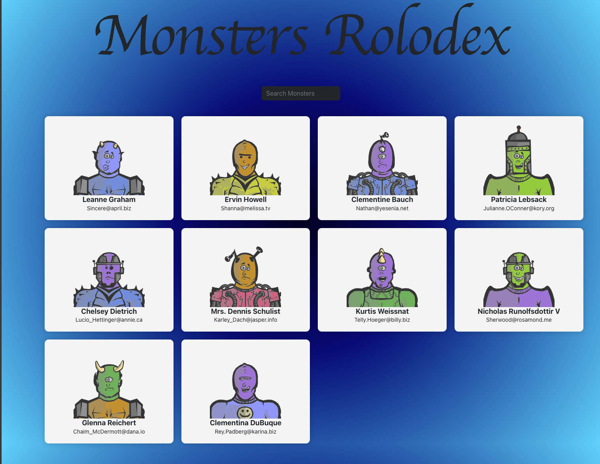

# Monster Rolodex

Monster Rolodex is a React application that fetches and displays a list of monsters from an API. Users can search for monsters and view their details in a responsive and interactive card layout.

## Features

- **Search Functionality:** Allows users to search for monsters by name.
- **Responsive Design:** Adjusts to different screen sizes using CSS grid.
- **Interactive Cards:** Displays monster details with hover effects.

## Technologies Used

- **React:** For building the user interface.
- **Axios:** For making HTTP requests to fetch monster data.
- **CSS:** For styling the application and ensuring responsiveness.

## Getting Started

### Prerequisites

- Node.js and npm installed

### Installation

1. Clone the repository:
    ```sh
    git clone https://github.com/Breedlove-Jason/monster-rolodex.git
    ```
2. Navigate to the project directory:
    ```sh
    cd monster-rolodex
    ```
3. Install dependencies:
    ```sh
    npm install
    ```
4. Start the development server:
    ```sh
    npm start
    ```

## Usage

1. Open the application in your browser.
2. Use the search box to find specific monsters by name.
3. View detailed information of each monster in the rolodex.

## License

This project is licensed under the MIT License - see the [LICENSE](LICENSE) file for details.

## Acknowledgments

- [JSONPlaceholder](https://jsonplaceholder.typicode.com/) for providing the fake online REST API.
- [RoboHash](https://robohash.org/) for generating unique monster images.
